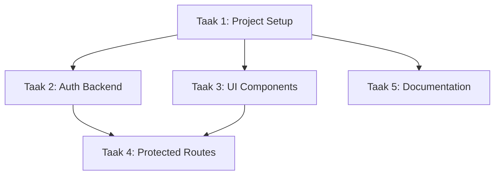

# ProjectStatus - [PROJECT NAAM]
**Gemaakt op:** [DATUM]
**Laatst bijgewerkt:** [DATUM]
**Project Status:** 🟡 In Progress / 🟢 Completed / 🔴 Blocked
**Versie:** 0.1.0

---

> **INSTRUCTIES**: Kopieer deze template naar `ProjectStatus-[JouwProjectNaam].md` en vul alle secties in. Lees altijd eerst [ProjectTemplate.md](./ProjectTemplate.md) voor best practices en richtlijnen.

---

## 📋 Sectie 1: Project Omschrijving

### Doel
[Beschrijf in 2-3 zinnen wat dit project doet en waarom het bestaat]

### Context
[Achtergrond informatie, business requirements, gebruikers, etc.]

### Scope
**In Scope:**
- [ ] Feature/functionaliteit 1
- [ ] Feature/functionaliteit 2
- [ ] Feature/functionaliteit 3

**Out of Scope:**
- [ ] Wat NIET in dit project zit
- [ ] Toekomstige features

### Success Criteria
```markdown
- [ ] Criterium 1 (bijv. "Gebruikers kunnen inloggen met email/password")
- [ ] Criterium 2 (bijv. "Dashboard toont real-time analytics")
- [ ] Criterium 3 (bijv. "Alle tests slagen met >80% coverage")
- [ ] Criterium 4 (bijv. "Security audit passed")
```

### Tech Stack
```markdown
**Frontend:**
- Framework: [bijv. React 19]
- Language: [bijv. TypeScript 5.x]
- Styling: [bijv. Tailwind CSS]
- State: [bijv. Zustand/Context]

**Backend:**
- Runtime: [bijv. Node.js]
- Framework: [bijv. Express]
- Database: [bijv. PostgreSQL]
- Auth: [bijv. JWT + bcrypt]

**Tools:**
- Version Control: Git
- Package Manager: [npm/pnpm/yarn]
- Testing: [bijv. Vitest + Playwright]
- CI/CD: [bijv. GitHub Actions]
```

---

## 🎯 Sectie 2: Taak Breakdown

> **Instructies**: Verdeel het project in concrete, uitvoerbare taken. Gebruik genummerde lijst met checkboxes. Voeg afhankelijkheden toe waar nodig.

### Taak Overzicht

| Taak # | Omschrijving | Prioriteit | Schatting | Afhankelijkheden | Status |
|--------|--------------|------------|-----------|------------------|--------|
| 1 | [Taak 1 naam] | 🔴 Hoog | 4h | Geen | ⬜ Open |
| 2 | [Taak 2 naam] | 🔴 Hoog | 6h | Taak 1 | ⬜ Open |
| 3 | [Taak 3 naam] | 🟡 Medium | 3h | Taak 1 | ⬜ Open |
| 4 | [Taak 4 naam] | 🟡 Medium | 8h | Taak 2, 3 | ⬜ Open |
| 5 | [Taak 5 naam] | 🟢 Laag | 2h | Geen | ⬜ Open |

**Status Legend:**
- ⬜ Open
- 🔵 In Progress
- ✅ Done
- 🚫 Blocked
- ⏸️ On Hold

### Gedetailleerde Taken

#### Taak 1: [Naam]
```markdown
**Omschrijving:** [Wat moet er gebeuren]

**Acceptatie Criteria:**
- [ ] Criterium 1
- [ ] Criterium 2
- [ ] Criterium 3

**Checklist:**
- [ ] Setup project structure (zie PROJECT_STRUCTURE_PATTERNS.md)
- [ ] TypeScript configuratie (strict mode)
- [ ] ESLint + Prettier setup
- [ ] Initial commit

**Referenties:**
- [ProjectTemplate.md](./ProjectTemplate.md)
- [PROJECT_STRUCTURE_PATTERNS.md](./PROJECT_STRUCTURE_PATTERNS.md)

**Afhankelijkheden:** Geen
**Kan parallel:** Nee (basis setup)
```

#### Taak 2: [Naam]
```markdown
**Omschrijving:** [Wat moet er gebeuren]

**Acceptatie Criteria:**
- [ ] Criterium 1
- [ ] Criterium 2

**Checklist:**
- [ ] [Sub-taak 1]
- [ ] [Sub-taak 2]
- [ ] [Sub-taak 3]

**Referenties:**
- [REACT_TYPESCRIPT_BEST_PRACTICES.md](./REACT_TYPESCRIPT_BEST_PRACTICES.md)
- [SECURITY_BEST_PRACTICES.md](./SECURITY_BEST_PRACTICES.md)

**Afhankelijkheden:** Taak 1
**Kan parallel:** Nee
```

#### Taak 3: [Naam]
```markdown
**Omschrijving:** [Wat moet er gebeuren]

**Acceptatie Criteria:**
- [ ] Criterium 1
- [ ] Criterium 2

**Checklist:**
- [ ] [Sub-taak 1]
- [ ] [Sub-taak 2]

**Referenties:**
- [Relevante guide]

**Afhankelijkheden:** Taak 1
**Kan parallel:** Ja (met Taak 2)
```

---

## ⚡ Sectie 3: Parallellisme en Capaciteit

> **Instructies**: Definieer welke taken tegelijk kunnen en hoeveel werkers er maximaal aan het project kunnen werken.

### Capaciteit Regels

```markdown
**Maximaal aantal werkers tegelijk:** [bijv. 3]

**Rationale:**
[Leg uit waarom dit aantal - bijv. "3 werkers omdat we frontend, backend en testing parallel kunnen doen"]

**Resource Constraints:**
- Shared resources: [bijv. "Database migrations kunnen niet parallel"]
- Bottlenecks: [bijv. "Code review door 1 senior dev"]
```

### Parallellisme Matrix

| Taak # | Kan Parallel? | Met Welke Taken? | Afhankelijkheden | Max Werkers |
|--------|---------------|------------------|------------------|-------------|
| 1 | ❌ Nee | - | Geen | 1 |
| 2 | ❌ Nee | - | Taak 1 | 1 |
| 3 | ✅ Ja | Taak 2 | Taak 1 | 2 |
| 4 | ✅ Ja | Taak 5 | Taak 2, 3 | 2 |
| 5 | ✅ Ja | Taak 4 | Geen | 1 |

### Parallellisme Regels

```markdown
**Wat KAN parallel:**
- Frontend development en backend API development (na setup)
- Unit tests schrijven en documentatie schrijven
- UI componenten en business logic hooks
- Feature A en Feature B (als geen shared dependencies)

**Wat MOET sequentieel:**
- Database schema setup → data migrations
- Authentication setup → protected routes
- Base components → composed components
- CI/CD setup → automated deployments
```

### Voorbeeld Workflow



---

## 👥 Sectie 4: Assignment & Presence Lijst

> **Instructies**: Werkers claimen hier taken. Vul naam/ID in, vink checkbox aan, en voeg timestamps toe.

### Huidige Assignments

| Taak # | Werker Naam/ID | Status | Timestamp Claim | Timestamp Start | Timestamp Afgerond | Notities |
|--------|----------------|--------|-----------------|-----------------|-------------------|----------|
| 1 | - | ⬜ Open | - | - | - | - |
| 2 | - | ⬜ Open | - | - | - | - |
| 3 | - | ⬜ Open | - | - | - | - |
| 4 | - | ⬜ Open | - | - | - | - |
| 5 | - | ⬜ Open | - | - | - | - |

### Actieve Werkers

```markdown
**Totaal actieve werkers:** 0 / [MAX]

**Werker Details:**
- [Naam/ID 1]: Werkt aan [Taak #] sinds [timestamp]
- [Naam/ID 2]: Werkt aan [Taak #] sinds [timestamp]
```

### Claim Procedure

```markdown
**Om een taak te claimen:**
1. Check Sectie 3 (Parallellisme): Mag ik deze taak claimen?
   - Is max werkers bereikt? → Wacht
   - Zijn dependencies klaar? → Check Sectie 2
   - Kan het parallel? → Check matrix

2. Update Assignment tabel:
   - Vul je naam/ID in
   - Update status naar "🔵 In Progress"
   - Voeg timestamp toe (bijv. "2024-11-14 10:30")

3. Update Sectie 5 (Updates Log):
   - Log dat je begonnen bent
   - Noteer eventuele initiële bevindingen

4. Commit changes:
   ```bash
   git add ProjectStatus-[ProjectNaam].md
   git commit -m "docs: claim taak [#] - [korte beschrijving]"
   git push
   ```
```

---

## 📝 Sectie 5: Updates Log (Append-Only)

> **Instructies**: Log alle belangrijke updates, bevindingen, blokkades en beslissingen. Nieuwste updates bovenaan.

### 2024-11-14

#### [10:30] - Werker: [Naam] - Taak #1
```markdown
**Status:** Begonnen met project setup

**Uitgevoerd:**
- Project repository geïnitialiseerd
- Directory structuur aangemaakt volgens PROJECT_STRUCTURE_PATTERNS.md
- TypeScript en ESLint geconfigureerd

**Bevindingen:**
- TypeScript strict mode enabled
- ESLint configuratie extended van recommended

**Volgende stappen:**
- Git hooks setup met Husky
- Initial commit maken

**Blokkades:** Geen
```

#### [12:45] - Werker: [Naam] - Taak #1
```markdown
**Status:** Taak #1 afgerond

**Resultaat:**
- ✅ Project setup compleet
- ✅ Alle dev dependencies geïnstalleerd
- ✅ Git hooks werkend
- ✅ Initial commit gemaakt

**Code/Links:**
- Commit: `abc123def` - "chore: initial project setup"
- Branch: `feature/project-setup`

**Unlock:** Taak #2 en #3 kunnen nu starten (dependencies opgelost)

**Blokkades:** Geen
```

---

### 2024-11-15

#### [09:00] - Werker: [Naam] - Taak #2
```markdown
**Status:** Begonnen met authentication backend

**Uitgevoerd:**
- User model aangemaakt met TypeScript types
- Bcrypt dependency toegevoegd
- Auth service skeleton gecreëerd

**Bevindingen:**
- Volg SECURITY_BEST_PRACTICES.md voor password hashing
- JWT library kiezen: jsonwebtoken vs jose

**Volgende stappen:**
- ADR schrijven voor JWT library keuze
- Password validation implementeren

**Blokkades:**
- ⚠️ Wachten op database schema approval (escaleer naar tech lead)
```

---

## 📊 Sectie 6: Voltooiing Check

> **Instructies**: Track overall progress en final checks voor project completion.

### Overall Progress

```markdown
**Totaal Taken:** [bijv. 5]
**Afgerond:** [bijv. 2] (40%)
**In Progress:** [bijv. 1] (20%)
**Blocked:** [bijv. 0] (0%)
**Open:** [bijv. 2] (40%)

**Geschatte voltooiing:** [datum]
**Actual voltooiing:** [datum wanneer klaar]
```

### Progress Bar
```
[████████░░░░░░░░░░░░] 40% Complete
```

### Success Criteria Status

```markdown
- [ ] ✅ Alle taken afgerond
- [ ] ✅ Alle tests slagen (>80% coverage)
- [ ] ✅ Code review approved
- [ ] ✅ Security audit passed
- [ ] ✅ Documentation compleet
- [ ] ✅ Deployed naar staging
- [ ] ✅ User acceptance testing passed
- [ ] ✅ Performance benchmarks gehaald
```

### Final Review Checklist

**Code Quality:**
```markdown
- [ ] Alle code volgt ProjectTemplate.md best practices
- [ ] Geen TypeScript `any` types
- [ ] Components < 300 regels
- [ ] Hooks < 200 regels
- [ ] Services < 250 regels
- [ ] Barrel files overal gebruikt
```

**Security:**
```markdown
- [ ] Input validation overal
- [ ] XSS prevention geïmplementeerd
- [ ] CSRF protection actief
- [ ] Passwords gehashed met bcrypt
- [ ] Security headers geconfigureerd
- [ ] Rate limiting actief
```

**Testing:**
```markdown
- [ ] Unit tests voor alle features (>80% coverage)
- [ ] Integration tests voor kritieke flows
- [ ] E2E tests voor user journeys
- [ ] All tests passing in CI/CD
- [ ] Performance tests passed
```

**Documentation:**
```markdown
- [ ] README.md compleet en up-to-date
- [ ] API documentation aanwezig
- [ ] Feature documentation geschreven
- [ ] ADRs voor belangrijke beslissingen
- [ ] Setup instructies getest door nieuwe dev
```

**Git & Deployment:**
```markdown
- [ ] All commits volgen Conventional Commits
- [ ] Branch naming conventions gevolgd
- [ ] PR template gebruikt voor alle PRs
- [ ] Code review process gevolgd
- [ ] Main branch bevat production-ready code
- [ ] Versioning correct (Semantic Versioning)
- [ ] Changelog bijgewerkt
```

---

## 🎯 Project Completion

### Completion Criteria

**Project is COMPLEET als:**
```markdown
- ✅ Alle taken in Sectie 2 zijn afgerond
- ✅ Alle Success Criteria uit Sectie 1 zijn gehaald
- ✅ Final Review Checklist is 100% afgevinkt
- ✅ Production deployment succesvol
- ✅ Handover documentatie compleet
```

### Archivering

**Bij project completion:**
```markdown
1. Update Status bovenaan naar "🟢 Completed"
2. Vul "Actual voltooiing" datum in
3. Schrijf project retrospective in Sectie 7
4. Commit final status
5. Tag release met semantic version
6. Archiveer ProjectStatus file
7. Update team wiki/documentatie
```

---

## 🔄 Sectie 7: Retrospective (Na Voltooiing)

> **Instructies**: Vul in na project completion voor toekomstige referentie.

### Wat Ging Goed
```markdown
- [Item 1]
- [Item 2]
- [Item 3]
```

### Wat Kan Beter
```markdown
- [Item 1]
- [Item 2]
- [Item 3]
```

### Geleerde Lessen
```markdown
- [Les 1]
- [Les 2]
- [Les 3]
```

### Aanbevelingen voor Volgende Projecten
```markdown
- [Aanbeveling 1]
- [Aanbeveling 2]
- [Aanbeveling 3]
```

### Metrics
```markdown
**Planning vs Actual:**
- Geschatte tijd: [X uren]
- Actuele tijd: [Y uren]
- Variance: [+/- %]

**Quality Metrics:**
- Test coverage: [%]
- Bug count in production: [#]
- Performance score: [score]

**Team Metrics:**
- Aantal werkers: [#]
- Aantal commits: [#]
- Aantal PRs: [#]
- Code review turnaround: [gemiddelde tijd]
```

---

## 📚 Referenties

**Template & Best Practices:**
- [ProjectTemplate.md](./ProjectTemplate.md) - Vaste basis, lees altijd eerst
- [REACT_TYPESCRIPT_BEST_PRACTICES.md](./REACT_TYPESCRIPT_BEST_PRACTICES.md)
- [PROJECT_STRUCTURE_PATTERNS.md](./PROJECT_STRUCTURE_PATTERNS.md)
- [SECURITY_BEST_PRACTICES.md](./SECURITY_BEST_PRACTICES.md)
- [TESTING_BEST_PRACTICES.md](./TESTING_BEST_PRACTICES.md)
- [ERROR_HANDLING_PATTERNS.md](./ERROR_HANDLING_PATTERNS.md)
- [GIT_WORKFLOW.md](./GIT_WORKFLOW.md)
- [DOCUMENTATION_PATTERNS.md](./DOCUMENTATION_PATTERNS.md)
- [ARCHITECTURE_DECISION_RECORDS.md](./ARCHITECTURE_DECISION_RECORDS.md)

**External Resources:**
- [Project repository](#)
- [Design files](#)
- [API documentation](#)

---

## 💡 Tips

**Voor Effectief Gebruik:**
```markdown
✅ DO:
- Lees altijd eerst ProjectTemplate.md voor elke taak
- Update log direct na belangrijke bevindingen
- Claim taken voor je begint (voorkom duplicatie)
- Check dependencies voor je start
- Commit regelmatig

❌ DON'T:
- ProjectTemplate.md aanpassen (read-only)
- Taken claimen zonder te checken parallellisme
- Updates log vergeten bij te werken
- Blokkades niet melden
- Zonder testing afronden
```

---

**Version History:**

| Versie | Datum | Wijzigingen | Auteur |
|--------|-------|-------------|---------|
| 0.1.0 | [DATUM] | Initiële setup van ProjectStatus | [NAAM] |

---

**ONTHOUD:**
- ✅ ProjectTemplate.md = READ-ONLY (algemene best practices)
- ✅ ProjectStatus-[ProjectNaam].md = WRITE (project-specifieke updates)
- ✅ Update deze file regelmatig
- ✅ Gebruik git voor version control
- ✅ Communiceer blokkades direct

**Happy Building! 🚀**
